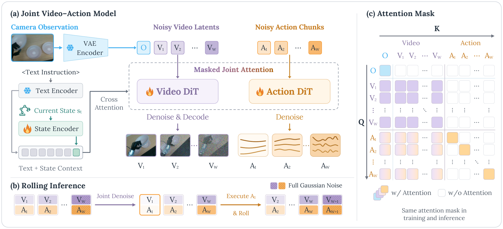

> **Code and checkpoints are being prepared and will be released soon. Please stay tuned!**

<h2 align="center">Rolling-WAM: World Action Models with Rolling Imagination</h2>

<p align="center">
  <a href="https://zyinghua.github.io/">Yinghua Zhou</a><sup>1,2,*</sup> &nbsp;
  <a href="https://junjieye.com/">Junjie Ye</a><sup>1,*</sup> &nbsp;
  <a href="https://zhaoy37.github.io/">Yiqi Zhao</a><sup>1</sup> &nbsp;
  <a href="https://www.linkedin.com/in/hao-dong-711324309/">Hao Dong</a><sup>1</sup> &nbsp;
  <a href="https://scholar.google.com/citations?user=2RCZsUkAAAAJ&amp;hl=en">Celina Shiyu Wang</a><sup>1</sup><br>
  <a href="https://gelev97.github.io/">Ruohai Ge</a><sup>1</sup> &nbsp;
  Tingyi Yang<sup>1,3</sup> &nbsp;
  <a href="https://basile.be/">Basile Van Hoorick</a><sup>4</sup> &nbsp;
  <a href="https://uscresl.org/principal-investigator/">Gaurav Sukhatme</a><sup>1</sup> &nbsp;
  <a href="https://vitorguizilini.github.io/">Vitor Guizilini</a><sup>4,†</sup> &nbsp;
  <a href="https://yuewang.xyz/">Yue Wang</a><sup>1,†</sup>
</p>

<p align="center">
  <sup>1</sup> University of Southern California &nbsp; · &nbsp;
  <sup>2</sup> Brown University<br>
  <sup>3</sup> Fudan University &nbsp; · &nbsp;
  <sup>4</sup> Toyota Research Institute<br>
  <sup>*</sup> Equal contribution &nbsp; · &nbsp; <sup>†</sup> Equal advising
</p>

<p align="center">
  <a href="https://rolling-wam.github.io/"></a>
  <a href="https://arxiv.org/abs/2609.30247"></a>
  <a href="LICENSE"></a>
</p>

## Abstract

World Action Models (WAMs) couple action generation with future visual prediction for robotic manipulation. However, completing the joint video-action denoising process at each replanning cycle incurs substantial latency, delaying action updates and limiting closed-loop responsiveness. We present Rolling-WAM, a formulation that distributes joint denoising across successive replanning cycles. Our method maintains a sliding window of video-action chunks at staggered noise levels. At each step, a rolling noise schedule fully denoises the imminent action chunk for execution, while partially refining farther-future chunks. As the window advances with new camera observations, the retained future chunks continue their denoising process. This distributes the computational cost over time while carrying an evolving visual-action context across chunk boundaries. Evaluations on LIBERO, RoboTwin, and a real-world Unitree G1 humanoid show that Rolling-WAM achieves competitive manipulation performance. By removing the need to denoise the entire prediction horizon from scratch, it delivers a 4.5× steady-state replanning speedup over standard joint WAMs.



## Overview

Rolling-WAM jointly predicts video and actions in a rolling window: refine the predictions, execute the next action chunk, and carry the remaining predictions into the next cycle. See the [project page](https://rolling-wam.github.io/) for method details and experimental results.

## Acknowledgements

Our work is built upon [FastWAM](https://github.com/yuantianyuan01/FastWAM) and [Wan 2.2](https://github.com/Wan-Video/Wan2.2). Our simulation experiments use the [RoboTwin](https://github.com/RoboTwin-Platform/RoboTwin) and [LIBERO](https://github.com/Lifelong-Robot-Learning/LIBERO) benchmarks. We thank their authors for making their code, pretrained models, and datasets publicly available.

## Citation

```bibtex
@misc{zhou2026rollingwamworldactionmodels,
  title = {Rolling-WAM: World Action Models with Rolling Imagination},
  author = {Yinghua Zhou and Junjie Ye and Yiqi Zhao and Hao Dong
            and Celina Shiyu Wang and Ruohai Ge and Tingyi Yang
            and Basile Van Hoorick and Gaurav Sukhatme
            and Vitor Guizilini and Yue Wang},
  year = {2026},
  eprint = {2609.30247},
  archivePrefix = {arXiv},
  primaryClass = {cs.RO},
  url = {https://arxiv.org/abs/2609.30247}
}
```

## License

This repository is licensed under the [Apache License 2.0](LICENSE). Third-party material retains its original licensing terms.
